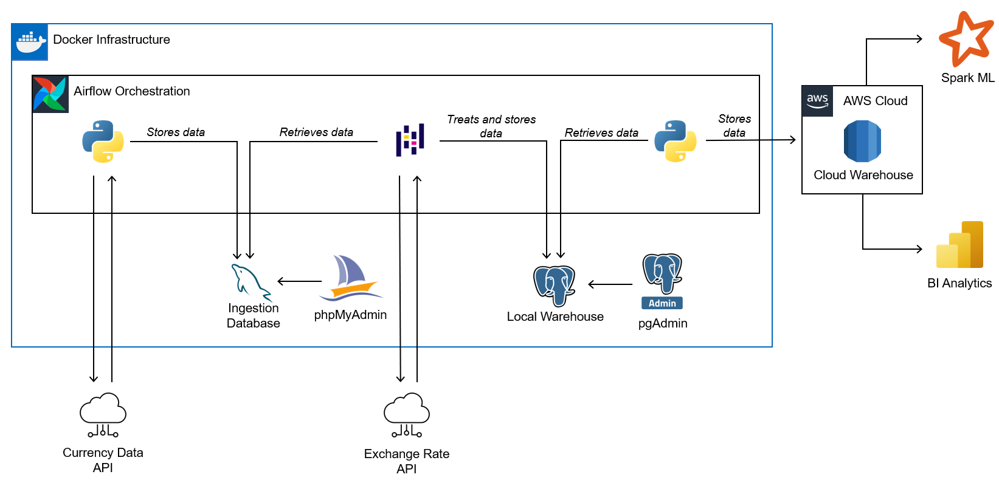

# Project Overview

This project encompasses the journey of raw data, from ingestion into a database, through treatment, to loading into both local and cloud-based warehouses, ending in the extraction of insights through ML and BI. The orchestration of tasks is made using Airflow's TaskFlow features, ensuring a robust pipeline. Airflow, the ingestion database, and the local warehouse are all encapsulated within containers, facilitating seamless implementation and deployment.

It's important to note that the essence of this project is not the data itself, but the architecture of the infrastructure and the pipeline. The pipeline is designed to enable smooth data transit between components, minimizing the risk of errors. Furthermore, the interfaces, services and helpers are designed with reusability in mind, allowing for easy adaptation to different contexts. This flexibility ensures that the infrastructure can accommodate various databases and workflows, needing only to implement the new logic.

## Project Structure

The repository is organized into the following files and folders:

- `/airflow`: Everything related to Airflow. Logs, DAGs and a Dockerfile for a custom Airflow image.
- `/airflow/dags/currency_data_pipeline.py`: The main Pipeline for this project. Built using Airflow`s TaskFlow operations.
- `/dbml`: DBML files used for database documentation at [dbdocs.io](https://dbdocs.io/ "dbdocs.io")
- `/sql`: SQL files used for creating the three databases: ingestion, local warehouse and cloud warehouse. These files are used during container initialization.
- `/python/interfaces`: Base interfaces containing abstract methods. The interfaces are used by `services`
- `/python/services`: Base classes for base functions using libraries like Requests, mysql.connector-python and psycopg2.
- `/python/helper`: Utilizes the base functionalities provided by `/python/services` for more elaborate operations.
- `/python/controller`: Program logic using helper classes and functions. The controller class is used for the DAG Pipeline logic.
- `/python/exceptions`: Custom exceptions used through the project.
- `/resources/images`: Images relating to the project. Architecure, Power BI Graphs, etc.
- `docker-compose.yaml`: Configuration file for Docker architecture.

## Pipeline Structure

Airflow calls a taks that fetches data from a external API. This data contains information about crypto currencies. This raw data is loaded into the ingestion database. The data is then fetched and treated using Pandas. After the data is properlly treated, it's loaded into the Local Warehouse. After that, the data in syncronized in a Cloud Warehouse.

## Project Architecture

The following diagram represents the architecture of this project:



## Database Documentation

The following links provide access to the database documentation hosted at [dbdocs.io](https://dbdocs.io/ "dbdocs.io"):

- [Ingestion Database](https://dbdocs.io/fersrp1964/ingestion_currency_data "Ingestion Database")
- [Data Warehouse (Local/Cloud)](https://dbdocs.io/fersrp1964/warehouse_currency_data "Data Warehouse (Local/Cloud)")

## Technologies

This project uses the following technologies:

- Airflow
- Docker
- Postgres
- MySQL
- AWS RDS
- Python
- Pandas
- Spark
- Power BI

## Getting Started

To get a local copy up and running, follow the following steps:

1. Clone the repository:
   ```sh
   git clone https://github.com/fernandoSantello/project-fictional-data-platform
   ```
2. Navigate to the project directory.
3. Set up your own .env file.
4. Build custom Airflow image using the Dockerfile at `/airflow`. The custom name and tag are `apache-airflow` and `fictional-data-platform` respectively:
   ```sh
   docker build -t <fictional-data-platform> <path_to_dockerfile_directory>
   ```
5. Create the Docker Architecure using `docker-compose.yaml` at root:
   ```sh
   docker-compose up
   ```
6. Access and use pgAdmin, phpMyAdmin and Airflow Webserver to explore the project.
7. NOTE: For the Cloud Warehouse, you will need an working AWS account and a RDS instance. If don't want to implement the cloud steps, you can delete "gather_data_for_cloud" and "load_data_to_cloud" tasks in the pipeline.

## License

Distributed under the MIT License. See `LICENSE` for more information.
